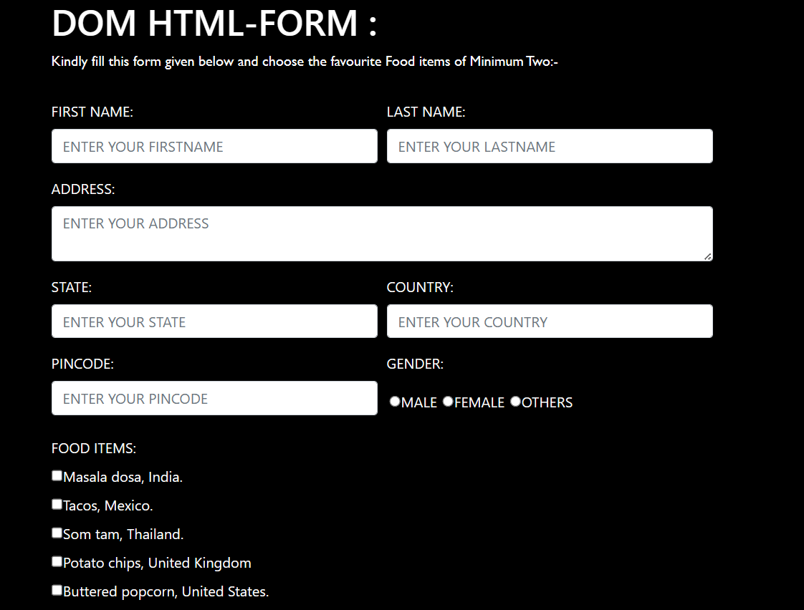
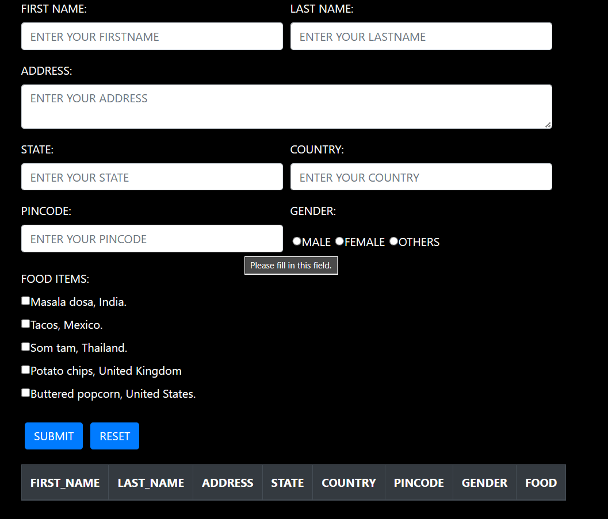

# `WEB DEVELOPER TASK`
## DOM Manipulation With Forms

* Here Create a form and table using HTML, CSS and DOM.
* The form contains following details.
* First name, last name, addres, pincode, gender, choice of food, state and country.
* To fill all the field and click the `submit` button, the values to be appended in the table.
* The column of the table is *First name, last name, addres, pincode, gender, food, state and country*.
* Clear the form fields after updating the records in the table.
* Added the test suite to inside the html body field.

## Here added a images for your reference

